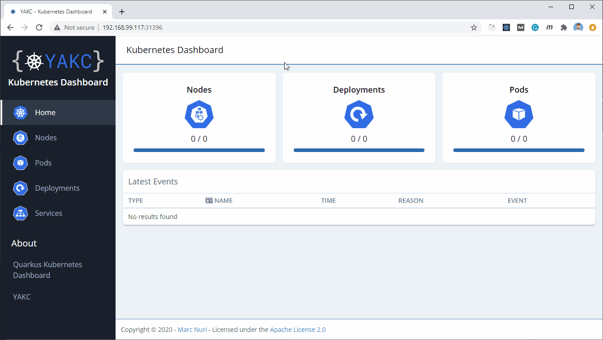

# YAKC - Kubernetes Dashboard

PoC to show how to build a Kubernetes dashboard with YAKC,
[Quarkus](https://quarkus.io) and [React](https://www.reactjs.org).

## Click the video to see a demo of the Dashboard

[](https://www.youtube.com/watch?v=Dum84fwA8_g)


## Getting started

### Minikube

If you want just to check-out the final project the easiest way is to deploy the
[released snapshot](https://hub.docker.com/r/marcnuri/yakc-kubernetes-dashboard)
into Minikube (or any other k8s cluster - needs access to node):

```shell script
# Deploy the application using https://hub.docker.com/r/marcnuri/yakc-kubernetes-dashboard SNAPSHOT
$ kubectl create -f https://raw.githubusercontent.com/manusa/yakc/master/quickstarts/quarkus-dashboard/docs/yakc-kubernetes-dashboard.minikube.yml
# Open Browser and navigate to deployed application
$ minikube service yakc-dashboard
``` 



### OpenShift Katacoda

You can test YAKC Kubernetes Dashboard by taking advantage of the OpenShift getting started Katacoda.

Access the Course (from Red Hat): https://learn.openshift.com/introduction/cluster-access/

Or access the Course (from Katacoda): https://www.katacoda.com/openshift/courses/developing-on-openshift/getting-started/

When the terminal loads, apply the provided YAKC Kubernetes Dashboard configuration:

```shell script
#
# Deploy the application using https://hub.docker.com/r/marcnuri/yakc-kubernetes-dashboard SNAPSHOT
#
$ oc create -f https://raw.githubusercontent.com/manusa/yakc/master/quickstarts/quarkus-dashboard/docs/yakc-kubernetes-dashboard.openshift-4.yml
service/yakc-quarkus-kubernetes-dashboard created
clusterrolebinding.rbac.authorization.k8s.io/yakc-kubernetes-dashboard-cluster-admin created
deployment.apps/yakc-quarkus-kubernetes-dashboard created
route.route.openshift.io/yakc-quarkus-kubernetes-dashboard created
#
# Retrieve URL for created route
#
$ echo "http://$(oc get route yakc-quarkus-kubernetes-dashboard -o jsonpath='{.spec.host}')"
http://yakc-dashboard-default.1337-13-kota037.environments.katacoda.com
```

Now you can open the URL in your browser.

## Build

To build the whole project (Front-end & Back-end), the easiest way is to run the Maven build with
the provided profile `build-frontend`.

```shell script
# Build project
$ mvn clean package -Pbuild-frontend
```

### Native image

Build the application using the `native` property.
```shell script
# On Windows first you need to run this
$ "C:\Program Files (x86)\Microsoft Visual Studio\2017\Community\VC\Auxiliary\Build\vcvars64.bat" && mvn clean install -Pnative
# To build (You can combine with the front-end build profiles)
$ mvn clean package -Dnative
```

#### (Windows) Install vc build tools

```shell script
$ choco install -y visualstudio2017community --no-progress --package-parameters "--add Microsoft.VisualStudio.Component.VC.Tools.ARM64 --add Microsoft.VisualStudio.Component.VC.CMake.Project"
```

## Build & Deploy to Minikube using Maven

Follow these instructions if you want to build & deploy the project into a Kubernetes Cluster, in
this case Minikube.

```shell script
# Provide access to Minikube's Docker daemon (allows to skip pushing the generated image)
$ eval $(minikube docker-env)
# Build and deploy project
$ mvn clean install -Pbuild-frontend,k8s
# Open Browser and navigate to deployed application
$ minikube service yakc-dashboard
```

This will also add a role binding for the default service account to the cluster-admin role in the
`default` namespace. In case you are working on a different namespace you can customize this
value by providing a value for the `k8s.namespace` project property:

```shell script
# Build and deploy project to custom namespace
$ mvn clean install -Pbuild-frontend,k8s -Dk8s.namespace=custom
```

## Development

You can work on the project with hot reload by starting both applications separately.

### Back-End

The back-end application is a Quarkus application, you can start it in development mode by:
```shell script
$ mvn quarkus:dev
```

### Front-End

You can find the React client application in the [`src/main/frontend`](src/main/frontend)
directory.

```shell script
# Install required dependencies
$ npm install
# Start development mode
$ npm start
```

You can point your browser to [localhost:3000](http://localhost:3000).