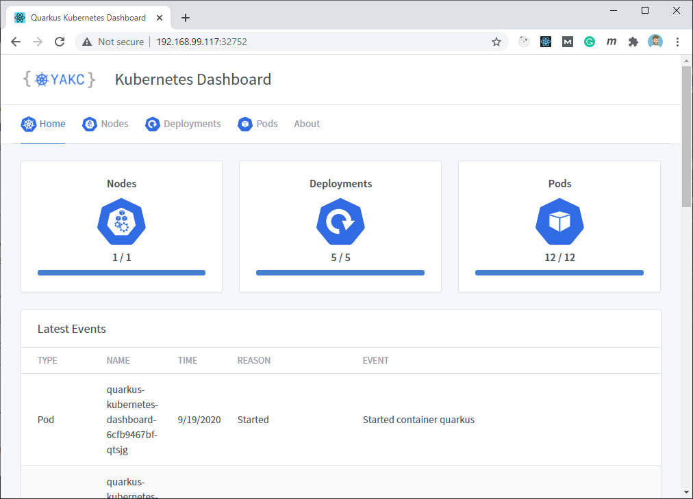

# YAKC - Kubernetes Dashboard

PoC to show how to build a Kubernetes dashboard with YAKC,
[Quarkus](https://quarkus.io) and [React](https://www.reactjs.org).

## Getting started

If you want just to check-out the final project the easiest way is to deploy the
[released snapshot](https://hub.docker.com/r/marcnuri/yakc-kubernetes-dashboard)
into Minikube (or any other k8s cluster - needs access to node):

```shell script
# Deploy the application using https://hub.docker.com/r/marcnuri/yakc-kubernetes-dashboard SNAPSHOT
$ kubectl create -f https://raw.githubusercontent.com/manusa/yakc/master/quickstarts/quarkus-dashboard/yakc-kubernetes-dashboard.minikube.yml
# Open Browser and navigate to deployed application
$ minikube service yakc-dashboard
``` 



## Build

To build the whole project (Front-end & Back-end), the easiest way is to run the Maven build with
the provided profile `build-frontend`.

```shell script
# Build project
$ mvn clean package -Pbuild-frontend
```

## Build & Deploy to Minikube using Maven

Follow these instructions if you want to build & deploy the project into a Kubernetes Cluster, in
this case Minikube.

```shell script
# Provide access to Minikube's Docker daemon (allows to skip pushing the generated image)
$ eval $(minikube docker-env)
# Build and deploy project
$ mvn clean install -Pbuild-frontend,k8s
# Open Browser and navigate to deployed application
$ minikube service yakc-dashboard
```

This will also add a role binding for the default service account to the cluster-admin role in the
`default` namespace. In case you are working on a different namespace you can customize this
value by providing a value for the `k8s.namespace` project property:

```shell script
# Build and deploy project to custom namespace
$ mvn clean install -Pbuild-frontend,k8s -Dk8s.namespace=custom
```

## Development

You can work on the project with hot reload by starting both applications separately.

### Back-End

The back-end application is a Quarkus application, you can start it in development mode by:
```shell script
$ mvn quarkus:dev
```

### Front-End

You can find the React client application in the [`src/main/frontend`](src/main/frontend)
directory.

```shell script
# Install required dependencies
$ npm install
# Start development mode
$ npm start
```

You can point your browser to [localhost:3000](http://localhost:3000).